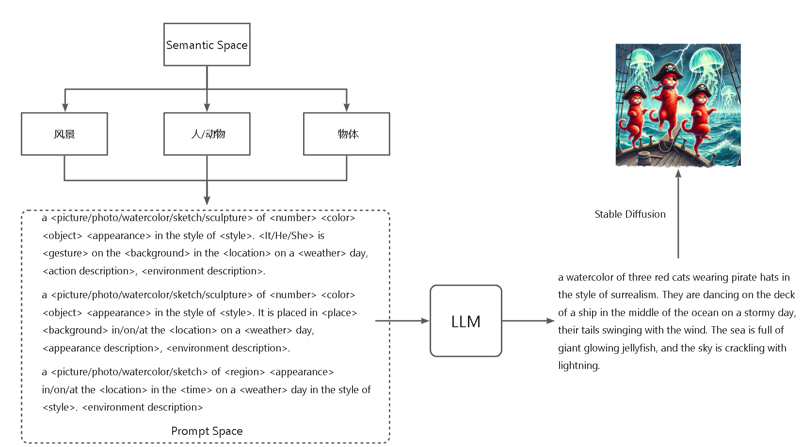
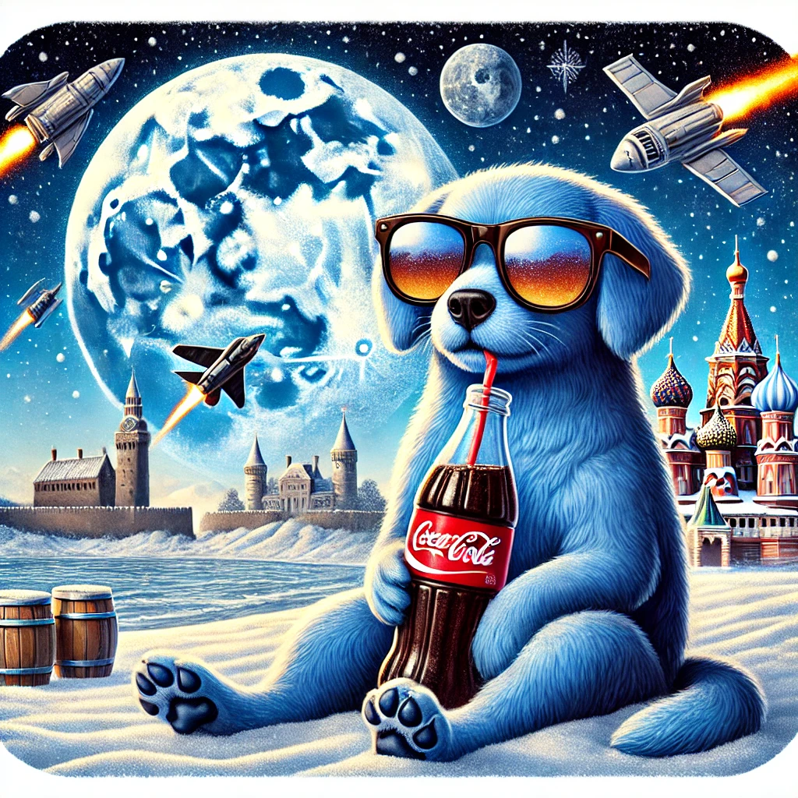

# On Exploring Adversarial Semantic Space of Large Vision- Language Model（暂名）
版本日期: 2024年9月19日

# Background

多模态大模型可能在现实世界中某些概念的理解上存在缺陷，我们可以将其称为“对抗的语义空间”（Adversarial Semantic Space）。

当前的针对多模态大模型的攻击主要是通过分别在图片模态和文本模态加入小的扰动，使得经过encoder编码之后的Visual Embedding和Text Embedding之间的距离增大，即攻击多模态大模型的跨模态对齐能力。但是，最近的工作在图片上的扰动方法主要还是Norm Bounded Attack，在文本上的扰动方法主要是类似Bert Attack之类的词替换攻击。它们希望尽可能减少对于图片-文本对原始语义的修改，以实现攻击对人类的不可感知性。

现在的方法存在很多问题：

1. Norm Bounded Attack得到的图片并不满足自然图片的分布，并且很容易被防御，很难模拟真实世界中的对抗样本。最有价值的工作在于找到多模态大模型语义空间中的知识缺陷，但是现有工作得到的对抗样本往往偏离了正常的语义空间，这种对抗样本对于想要提升多模态大模型的理解能力是没有意义的（我们不想让MLLM学到现实中不存在的知识，而是提升对现实知识的理解能力）。
2. 文本模态和图片模态在攻击过程中的交互有限，很难保证多个模态的扰动在空间中是协同的，可能对于单个模态而言扰动是有效的，但是就整体而言无法确定两个模态的扰动是否存在相互抵消的情况。
3. 缺乏可解释性，无法增强人们对于MLLM知识和能力的理解，无法针对性地去改进或提升MLLM。

# idea

针对现有方法存在的问题，我们想要提出一种可以在现实世界的语义空间中搜索多模态大模型的知识缺陷的方法，即寻找“对抗的语义空间”（Adversarial Semantic Space）。

1. 我们不使用Norm Bounded Attack攻击图片，而是采用Unrestricted Adversarial Attack，这种方式操纵图片的高级语义，使得生成更加自然和灵活的对抗样本。我们希望通过这种方式尽可能去模拟真实世界中多模态大模型可能见到的“困惑”样本，找到其知识上的缺陷。
2. Stable Diffusion等最先进的文生图模型保证了输入prompt与generated image之间高度的语义一致性。我们扰动文本模态，并使用基于Stable Diffusion的图像编辑和定制化生成模型让图片变化跟随文本上的扰动，并人工检查每一个图像-文本对的语义一致性，使得多个模态一起沿着我们既定的语义扰动方向更新。这保证了多模态协同攻击。
3. 不同于之前的工作 [Mutual-modality Adversarial Attack with Semantic Perturbation](https://www.notion.so/Mutual-modality-Adversarial-Attack-with-Semantic-Perturbation-1005694fb46a80d2b607fc604d131c5c?pvs=21)，我们选择扰动文本，随后让图片跟随文本更新。由于自然语言对人类具有天然的可解释性，根据图片的caption，我们可以轻松观察到语义是如何向对抗的方向迁移的。由此可以分析多模态大模型可能的知识缺陷分布在哪些语义内容上，以此针对性地优化多模态大模型。
# Pipeline

## 初始化：生成种子图像及对应文本描述

给语义空间划分为三类，针对每一个类别随机生成$N_i$描述。

找出TopK CLIPScore得分最低的几个图像-文本对，作为扰动种子。

a picture of a blue dog wearing sunglasses in the style of realistic. It is sitting on the beach in the moon on a snowy day, （it is drinking a bottle of cola. There are many medieval castles around and many spaceships in the sky.）

## 文本扰动

a watercolor of three red cats wearing pirate hats in the style of **surrealism**. They are dancing on the deck of a ship in the middle of the ocean on a stormy day, （their tails swinging with the wind. The sea is full of giant glowing jellyfish, and the sky is crackling with lightning.）

使用LLM进化算法更新Prompt，得到一个CLIPScore比较低的种子图像用来作定制化生成·。

## 定制化生成

<aside>
💡

主要思想：

考虑输入的有object的图像，定制化生成可以提取这个object，并为其生成多样的内容和场景。我们希望寻找对于特定的object，它处在何种的语义环境或者场景里具有对抗性，比如同样一只狗，它在“草地”、“沙滩”、“室内“这种自然的环境下可能比较容易被多模态大模型识别，但是在一些艺术设计场景比如“月球”、“赛博朋克”或者一些影响能见度的场景比如“大雾”、“暴雨”中，它很可能会超出多模态大模型的理解能力，为了寻找这种对抗的语义环境，我们使用定制化生成，在生成过程中保持主体不变，防止对抗性来自于主体，而去测试同一个object在何种环境下可能使多模态大模型性能下降。

</aside>

- 输入图片：使用上面的初始化生成种子（带有一定的对抗性）或者直接选用一张图片。
- 图片的GroundTruth：图片描述，即caption。
- TargetModel：MLLM
- 迭代更新方式：LLM进化算法（每一轮更新Prompt）

# 下游任务

## Caption生成任务

我们用于生成图片的Prompt是Ground Truth，比较MLLM生成的caption与Prompt的差别即可。

### Caption评测标准

简单的想法：测量文本语义相似度

图片来源于

代码：https://github.com/foundation-multimodal-models/CAPTURE

## VQA任务

在caption的生成和修改过程中始终保持固定格式：

<aside>
💡

a <picture/photo/watercolor/sketch/sculpture> of <number> <color> <object> <appearance> in the style of <style>. <It/He/She> is <gesture> on the <background> in the <location> on a <weather> day, <action description>, <environment description>.

</aside>

所以我们就可以设置一系列固定的问题，去询问每一个视觉元素，并且根据caption Ground Truth找出正确的答案。

比如：

- What is the weather like in this picture?
- What is the style of this picture?
- What is the subject of this picture?
- How many <object> are there in this image?（object从caption中获取）

… …（可以由LLM根据Caption生成，这样就获得了有标准答案的问题）

### VQA评测标准

简单的想法：测量文本语义相似度

搜集中

**Open-ended VQA benchmarking of Vision-Language models by exploiting Classification datasets and their semantic hierarchy（ICLR2024）**

# 更多

使用得到的对抗样本微调MLLM，检测其对MLLM的提升效果。（待定）
